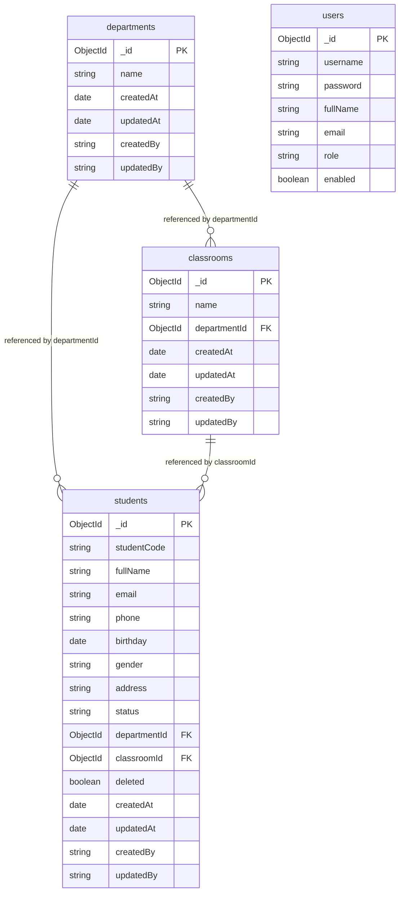

# Entity Relationship Diagram (ERD) - NoSQL Model

This document visualizes the document relationships and references in the MongoDB-backed Student Management System.

---

## 1. Document Schema Diagram

The collections are linked using referenced ObjectIds:

---

## 2. NoSQL Relationships & Design Rationale

1. **Normalized Referencing vs. Embedding**:
   - **Referencing** is chosen over embedding for Classrooms and Students because student enrollment changes frequently, and students/classrooms are queried as first-class entities. Embedding would create excessive document sizes and index bloat.
2. **Cardinality**:
   - **`departments` to `classrooms`**: 1-to-N. Each classroom document contains a `departmentId` pointing to the department.
   - **`classrooms` to `students`**: 1-to-N. Each student document contains a `classroomId` pointing to their classroom.
   - **`departments` to `students`**: 1-to-N. Each student document contains a `departmentId` pointing directly to their department to support faster department-level filter queries without joining classrooms.
3. **Users Collection**:
   - Stays isolated to handle AAA (Authentication, Authorization, and Auditing). User roles are represented by simple strings (`ADMIN`, `USER`).
