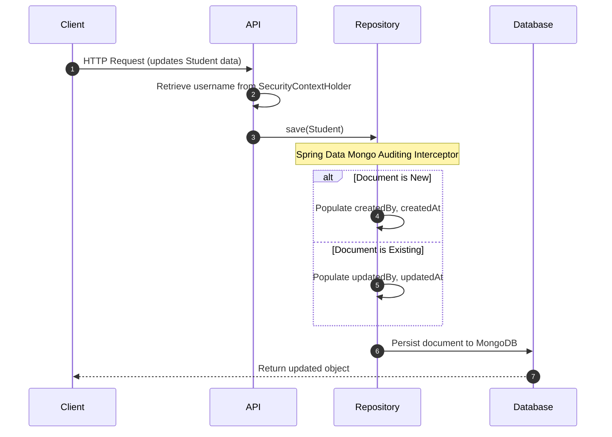

# Functional Specification: MongoDB Auditing

## 1. Functional Overview
Automatically capture, record, and update metadata regarding document creation and modification events (timestamps and administrative users) within MongoDB collections.

---

## 2. Audited Metadata Columns

| Field Name | Type | Set Trigger | Description |
| :--- | :--- | :--- | :--- |
| `createdAt` | Instant (Date) | On Document Insert | Timestamp of initial document persistence. |
| `updatedAt` | Instant (Date) | On Document Update | Timestamp of last document modification. |
| `createdBy` | String (Username) | On Document Insert | Username of admin/user creating the document. |
| `updatedBy` | String (Username) | On Document Update | Username of admin/user modifying the document. |

---

## 3. Operational Workflow

1. **Context Resolution**: The Spring Data MongoDB auditing engine intercepts entity persistence requests.
2. **Retrieve Username**:
   - Queries `SecurityContextHolder.getContext().getAuthentication()`.
   - If security context is null, unauthenticated, or anonymous, fallback to string `"system"`.
   - Otherwise, resolve current logged-in `username` string.
3. **Execution**:
   - For inserts: Inject current timestamp to `createdAt` and resolved username to `createdBy`.
   - For updates: Inject current timestamp to `updatedAt` and resolved username to `updatedBy`.
