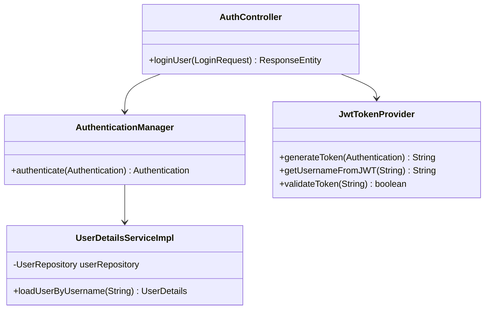

# RFC: User Login & JWT Generation Design

## 1. Technical Objective
Specify classes, models, security workflows, and token parsing to implement the user login endpoint (`POST /api/v1/auth/login`).

---

## 2. API Contract & Schema

### Endpoint Definition
```http
POST /api/v1/auth/login
Content-Type: application/json
```

### Request Payload (DTO: `LoginRequest`)
```json
{
  "username": "admin",
  "password": "admin123"
}
```

### Response Payload (DTO: `LoginResponse`)
```json
{
  "success": true,
  "message": "Logged in successfully",
  "data": {
    "accessToken": "eyJhbGciOiJIUzI1NiIsInR5cCI6IkpXVCJ9.eyJzdWIiOiJhZG1pbiIs...",
    "tokenType": "Bearer",
    "expiresIn": 86400000,
    "role": "ADMIN"
  }
}
```

---

## 3. Structural Design



### Authentication Flow Actions
1. **Request Interception**: Controller receives `LoginRequest`.
2. **Credential Checking**:
   - Controller calls `authenticationManager.authenticate(new UsernamePasswordAuthenticationToken(request.getUsername(), request.getPassword()))`.
   - The security manager delegates this check to `UserDetailsServiceImpl`, which loads the user document from the `users` collection in MongoDB.
   - If not found or if the password matching fails, throwing `BadCredentialsException`.
3. **JWT Generation**:
   - Upon successful credentials checking, call `jwtTokenProvider.generateToken(authentication)` to create a token signed with the HMAC secret key.
   - Return token and expiration time inside `LoginResponse`.
