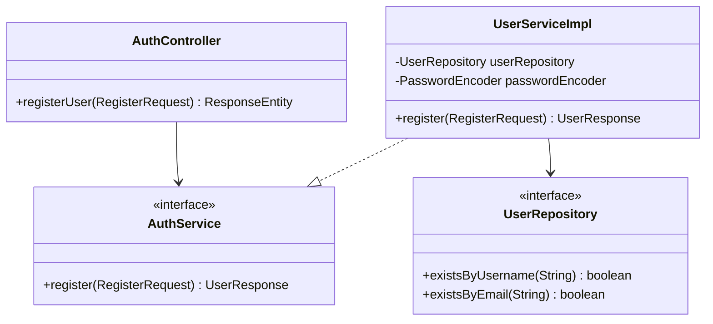

# RFC: User Registration Design

## 1. Technical Objective
Specify classes, models, and validation patterns to implement the user registration endpoint (`POST /api/v1/auth/register`).

---

## 2. API Contract & Schema

### Endpoint Definition
```http
POST /api/v1/auth/register
Content-Type: application/json
```

### Request Payload (DTO: `RegisterRequest`)
```json
{
  "username": "newuser",
  "password": "userpassword123",
  "fullName": "New User Display Name",
  "email": "newuser@example.com"
}
```

### Response Payload (DTO: `UserResponse`)
```json
{
  "success": true,
  "message": "User registered successfully",
  "data": {
    "id": "60c72b2f9b1d8b2bad000012",
    "username": "newuser",
    "fullName": "New User Display Name",
    "email": "newuser@example.com",
    "role": "USER",
    "enabled": true
  }
}
```

---

## 3. Structural Design



### Data Layer Interactions
- **Query 1**: `userRepository.existsByUsername(request.getUsername())` -> returns boolean.
- **Query 2**: `userRepository.existsByEmail(request.getEmail())` -> returns boolean.
- **Insert**: `userRepository.save(user)` -> saves user document in `users` collection.

---

## 4. Key Logic & Validation Steps

1. **JSR 380 Annotation Validation**:
   - `username`: `@NotBlank`, `@Size(min = 3, max = 50)`
   - `password`: `@NotBlank`, `@Size(min = 6)`
   - `fullName`: `@NotBlank`
   - `email`: `@NotBlank`, `@Email`
2. **Duplicate Assertions**:
   - If `existsByUsername` matches -> throw `DuplicateDataException("Username already exists")`.
   - If `existsByEmail` matches -> throw `DuplicateDataException("Email already exists")`.
3. **Password Encryption**:
   - Encode plain-text password using the configured BCrypt bean:
     ```java
     String hashedPassword = passwordEncoder.encode(request.getPassword());
     ```
4. **Persist State**:
   - Construct `User` document:
     - Set default role to `"USER"`.
     - Set status `enabled = true`.
     - Assign generated ID automatically via MongoDB ObjectId.
