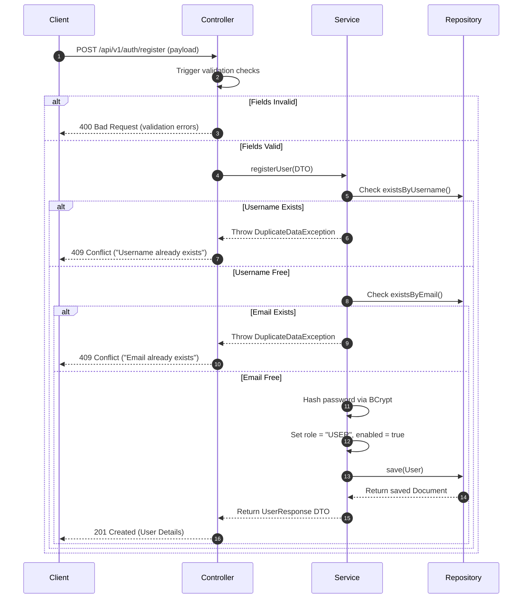

# Functional Specification: User Registration

## 1. Functional Overview
This feature allows unauthenticated visitors to create a new user account with default permissions (`USER` role), enabling subsequent login.

---

## 2. Input Validation Matrix

| Field Name | Type | Constraints | Failure Trigger | Error Response Code / Message |
| :--- | :--- | :--- | :--- | :--- |
| `username` | String | Not blank, size 3-50 | Empty, or < 3 or > 50 chars | 400 Bad Request / "Username size must be between 3 and 50" |
| `password` | String | Not blank, min 6 chars | Empty, or < 6 chars | 400 Bad Request / "Password must be at least 6 characters long" |
| `fullName` | String | Not blank | Empty or whitespace | 400 Bad Request / "Full name is required" |
| `email` | String | Not blank, email syntax | Empty or invalid pattern | 400 Bad Request / "Email format is invalid" |

---

## 3. Operational Workflow



---

## 4. Response Scenarios

### Success Scenario (201 Created)
- **Condition**: Payload contains valid values, username and email do not exist in system.
- **Response**:
```json
{
  "success": true,
  "message": "User registered successfully",
  "data": {
    "id": "60c72b2f9b1d8b2bad000012",
    "username": "newuser",
    "fullName": "New User Display Name",
    "email": "newuser@example.com",
    "role": "USER",
    "enabled": true
  }
}
```

### Uniqueness Conflict Scenario (409 Conflict)
- **Condition**: Username or email already exists in `users` collection.
- **Response**:
```json
{
  "success": false,
  "message": "Username already exists"
}
```
