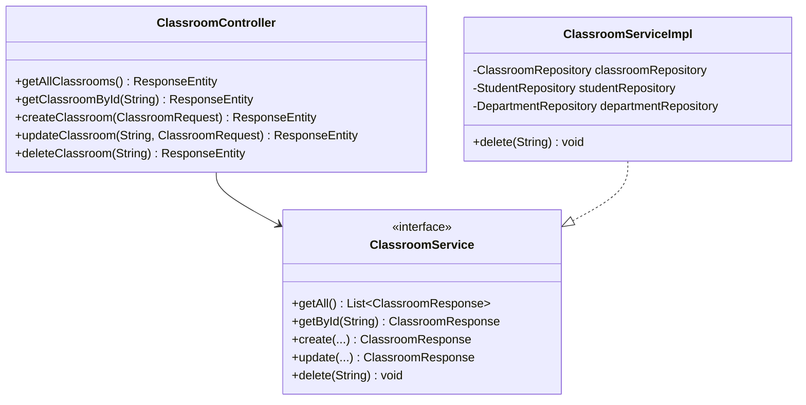

# RFC: CRUD Classroom Design

## 1. Technical Objective
Specify classes, models, and cascade protection rules to implement CRUD operations on Classrooms.

---

## 2. API Contract & Schema

### Endpoint Mappings
- `GET /api/v1/classrooms` -> List all classrooms.
- `GET /api/v1/classrooms/{id}` -> Get classroom by ID.
- `POST /api/v1/classrooms` -> Create a classroom.
- `PUT /api/v1/classrooms/{id}` -> Update classroom name or departmentId.
- `DELETE /api/v1/classrooms/{id}` -> Delete classroom (fails if active students exist in it).

---

## 3. Structural Design

### Data Layer Interactions
- **Referential check on Department**: `departmentRepository.existsById(request.getDepartmentId())`
- **Referential check for Deletion**:
  - `studentRepository.existsByClassroomIdAndDeletedFalse(classroomId)` -> Returns boolean indicating if active student documents refer to this classroom.

---

## 4. Key Logic & Validation Steps

1. **Relation Checks**:
   - Creating/updating a Classroom requires validating that the target `departmentId` exists. If not, throw `ResourceNotFoundException`.
2. **Delete Cascade Protection**:
   - Inside `ClassroomServiceImpl.delete(id)`:
     - Check if Classroom exists. Throw 404 if missing.
     - Call `studentRepository.existsByClassroomIdAndDeletedFalse(id)`.
     - If `true`, throw `ConstraintViolationException("Cannot delete classroom containing active students")` (translates to HTTP 400 Bad Request).
     - If `false`, call `classroomRepository.deleteById(id)`.
