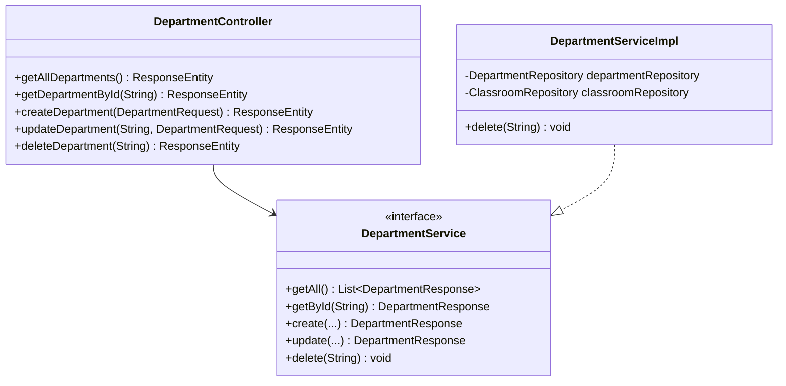

# RFC: CRUD Department Design

## 1. Technical Objective
Specify classes, models, and cascade protection rules to implement CRUD operations on Departments.

---

## 2. API Contract & Schema

### Endpoint Mappings
- `GET /api/v1/departments` -> List all departments.
- `GET /api/v1/departments/{id}` -> Get department by ID.
- `POST /api/v1/departments` -> Create a new department.
- `PUT /api/v1/departments/{id}` -> Update department name.
- `DELETE /api/v1/departments/{id}` -> Delete department (fails if classrooms belong to it).

---

## 3. Structural Design

### Data Layer Interactions
- **Uniqueness checks**: `departmentRepository.existsByName(request.getName())`
- **Referential checking for deletion**:
  - `classroomRepository.existsByDepartmentId(departmentId)` -> Returns boolean indicating if classrooms reference this department.

---

## 4. Key Logic & Validation Steps

1. **Delete Cascade Protection**:
   - Inside `DepartmentServiceImpl.delete(id)`:
     - Check if Department exists using `findById(id)`. Throw 404 if missing.
     - Call `classroomRepository.existsByDepartmentId(id)`.
     - If `true`, throw `ConstraintViolationException("Cannot delete department containing classrooms")` (translates to HTTP 400 Bad Request).
     - If `false`, call `departmentRepository.deleteById(id)`.
2. **Access Security**:
   - Write actions (`POST`, `PUT`, `DELETE`) are restricted to the `ADMIN` role. Read actions (`GET`) permit `USER` and `ADMIN` roles.
