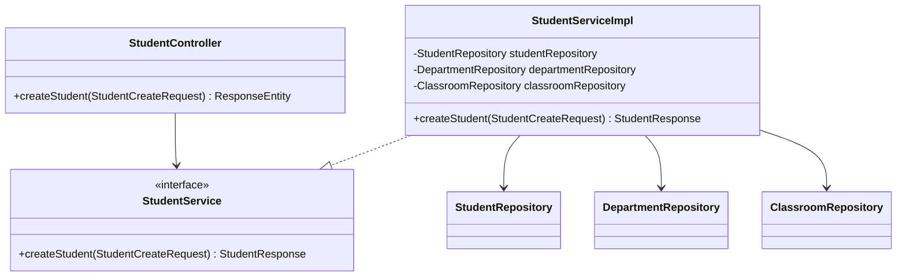

# RFC: Create Student Design

## 1. Technical Objective
Specify classes, models, and uniqueness validations to implement the student creation endpoint (`POST /api/v1/students`).

---

## 2. API Contract & Schema

### Endpoint Definition
```http
POST /api/v1/students
Authorization: Bearer <Token>
Content-Type: application/json
```

### Request Payload (DTO: `StudentCreateRequest`)
```json
{
  "studentCode": "SV004",
  "fullName": "Le Thi D",
  "email": "thid@gmail.com",
  "phone": "0934567890",
  "birthday": "2004-09-12",
  "gender": "FEMALE",
  "address": "Danang",
  "departmentId": "60c72b2f9b1d8b2bad000003",
  "classroomId": "60c72b2f9b1d8b2bad000005"
}
```

### Response Payload (JSON)
```json
{
  "success": true,
  "message": "Student created successfully",
  "data": {
    "id": "60c72b2f9b1d8b2bad000009",
    "studentCode": "SV004",
    "fullName": "Le Thi D",
    "email": "thid@gmail.com",
    "phone": "0934567890",
    "birthday": "2004-09-12",
    "gender": "FEMALE",
    "address": "Danang",
    "status": "ACTIVE",
    "departmentId": "60c72b2f9b1d8b2bad000003",
    "classroomId": "60c72b2f9b1d8b2bad000005"
  }
}
```

---

## 3. Structural Design



### Data Layer Interactions
- **Uniqueness checks**:
  - `studentRepository.existsByStudentCode(request.getStudentCode())`
  - `studentRepository.existsByEmail(request.getEmail())`
  - `studentRepository.existsByPhone(request.getPhone())`
- **Referential checks**:
  - `departmentRepository.findById(request.getDepartmentId())`
  - `classroomRepository.findById(request.getClassroomId())`

---

## 4. Key Logic & Validation Steps

1. **DTO Validation**:
   - `studentCode`, `fullName`, `email`, `phone`, `birthday`, `gender`, `departmentId`, `classroomId` are validated via standard constraints.
2. **Checks**:
   - Throw `DuplicateDataException` if any uniqueness checks match.
   - Throw `ResourceNotFoundException` if department or classroom are not found.
3. **Execution**:
   - Map request DTO to Student Document.
   - Set status to `"ACTIVE"` and `deleted = false`.
   - Save via `studentRepository.save(student)`.
