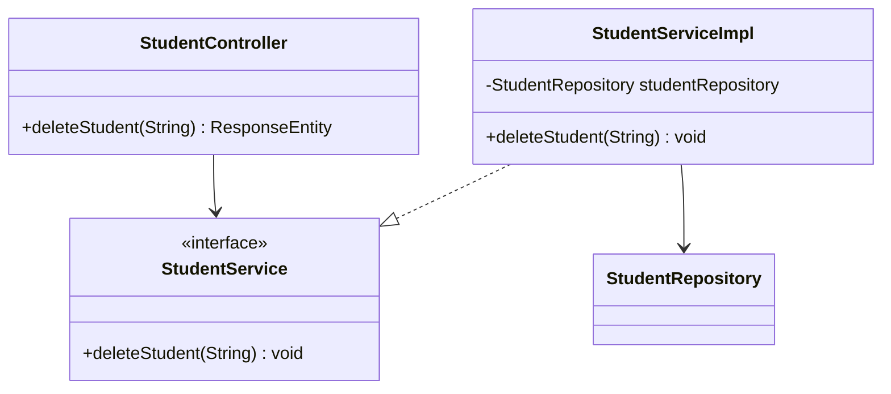

# RFC: Delete Student Design

## 1. Technical Objective
Specify classes, models, and states to implement the soft-delete student endpoint (`DELETE /api/v1/students/{id}`).

---

## 2. API Contract & Schema

### Endpoint Definition
```http
DELETE /api/v1/students/{id}
Authorization: Bearer <Token>
```

### Response Payload (JSON)
```json
{
  "success": true,
  "message": "Student deleted successfully (Soft delete)"
}
```

---

## 3. Structural Design



### Data Layer Interactions
- **Fetch Active Entity**: `studentRepository.findByIdAndDeletedFalse(id)`
- **Save State**: `studentRepository.save(student)`

---

## 4. Key Logic & Validation Steps

1. **Existence validation**:
   - Query for student using `findByIdAndDeletedFalse(id)`.
   - If empty (student does not exist, or is already marked as deleted), throw `ResourceNotFoundException("Student not found")`.
2. **Execution**:
   - Set the `deleted` flag on the entity to `true`.
   - Save the changed entity using `studentRepository.save(student)`.
   - Resulting record in MongoDB `students` collection will have `deleted: true`.
3. **Response**: Return a 200 OK success JSON response.
