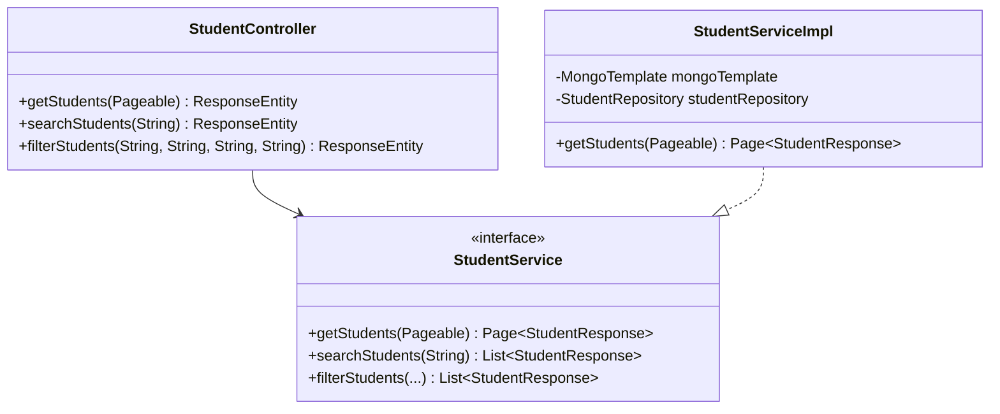

# RFC: Query Student Design

## 1. Technical Objective
Specify classes, query constructions, and response formatting to implement student directory lookups, pagination, keyword searches, and multi-criteria filters in MongoDB.

---

## 2. API Contracts & Parameters

### List Students (Paginated)
- **URL**: `GET /api/v1/students`
- **Params**: `page` (default 0), `size` (default 10), `sort` (default "id"), `direction` (default "asc").

### Search Students (Keyword)
- **URL**: `GET /api/v1/students/search`
- **Params**: `keyword` (required string).

### Filter Students (Multi-criteria)
- **URL**: `GET /api/v1/students/filter`
- **Params**: `departmentId` (optional), `classroomId` (optional), `gender` (optional), `status` (optional).

---

## 3. Structural Design



### Data Layer Interactions
- **List**: `studentRepository.findAllByDeletedFalse(Pageable pageable)`
- **Search & Filter (Dynamic Queries)**:
  - Construct a `Query` object using `MongoTemplate`.
  - Add criteria for search/filter and **always** include:
    ```java
    Criteria.where("deleted").is(false)
    ```
  - Example search predicate assembly:
    ```java
    Criteria search = new Criteria().orOperator(
        Criteria.where("fullName").regex(keyword, "i"),
        Criteria.where("studentCode").regex(keyword, "i")
    );
    query.addCriteria(search);
    List<Student> match = mongoTemplate.find(query, Student.class);
    ```

---

## 4. Key Logic & Validation Steps
1. **Pagination Parameter Resolving**:
   - Translate HTTP parameters to Spring Data `PageRequest.of(page, size, Sort.by(direction, sort))`.
2. **Dynamic query assembly**:
   - Check if filter parameters are present before appending `Criteria.where(paramName).is(paramValue)`.
3. **DTO mapping**: Convert all output List/Page content from `Student` documents to `StudentResponse` objects before returning.
