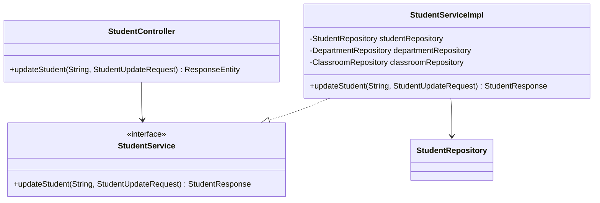

# RFC: Update Student Design

## 1. Technical Objective
Specify classes, models, and uniqueness validation to implement the student update endpoint (`PUT /api/v1/students/{id}`).

---

## 2. API Contract & Schema

### Endpoint Definition
```http
PUT /api/v1/students/{id}
Authorization: Bearer <Token>
Content-Type: application/json
```

### Request Payload (DTO: `StudentUpdateRequest`)
```json
{
  "fullName": "Nguyen Van A Edited",
  "email": "vana_new@gmail.com",
  "phone": "0912345678",
  "birthday": "2004-01-15",
  "gender": "MALE",
  "address": "Ho Chi Minh City, Dist 1",
  "status": "ACTIVE",
  "departmentId": "60c72b2f9b1d8b2bad000003",
  "classroomId": "60c72b2f9b1d8b2bad000005"
}
```

### Response Payload (JSON)
```json
{
  "success": true,
  "message": "Student updated successfully",
  "data": {
    "id": "60c72b2f9b1d8b2bad000007",
    "studentCode": "SV001",
    "fullName": "Nguyen Van A Edited",
    "email": "vana_new@gmail.com",
    "phone": "0912345678",
    "birthday": "2004-01-15",
    "gender": "MALE",
    "address": "Ho Chi Minh City, Dist 1",
    "status": "ACTIVE",
    "departmentId": "60c72b2f9b1d8b2bad000003",
    "classroomId": "60c72b2f9b1d8b2bad000005"
  }
}
```

---

## 3. Structural Design



### Data Layer Interactions
- **Fetch Entity**: `studentRepository.findByIdAndDeletedFalse(id)`
- **Uniqueness checks (excluding self)**:
  - `studentRepository.existsByEmailAndIdNot(request.getEmail(), id)`
  - `studentRepository.existsByPhoneAndIdNot(request.getPhone(), id)`
- **Referential checks**:
  - `departmentRepository.findById(request.getDepartmentId())`
  - `classroomRepository.findById(request.getClassroomId())`

---

## 4. Key Logic & Validation Steps

1. **Existence check**: If the student document does not exist, throw `ResourceNotFoundException("Student not found")`.
2. **Uniqueness checking**: Ensure new `email` and `phone` values are not utilized by *other* documents. If they are, throw `DuplicateDataException`.
3. **Save**: Copy request properties onto existing entity. Save via `studentRepository.save(student)`.
