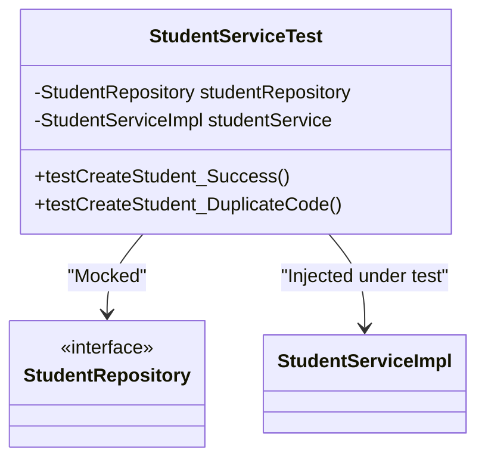

# RFC: Unit Testing Design

## 1. Technical Objective
Specify mocking annotations, test class lifecycles, and coverage configurations using JUnit 5 and Mockito.

---

## 2. Test Architecture

Services are tested in isolation. Data repositories are mocked to avoid database interactions:



---

## 3. Test Implementation Template

```java
@ExtendWith(MockitoExtension.class)
class StudentServiceTest {

    @Mock
    private StudentRepository studentRepository;

    @Mock
    private DepartmentRepository departmentRepository;

    @Mock
    private ClassroomRepository classroomRepository;

    @InjectMocks
    private StudentServiceImpl studentService;

    private StudentCreateRequest request;
    private Student student;

    @BeforeEach
    void setUp() {
        request = new StudentCreateRequest();
        request.setStudentCode("SV001");
        request.setEmail("vana@gmail.com");
        request.setDepartmentId("60c72b2f9b1d8b2bad000003");
        request.setClassroomId("60c72b2f9b1d8b2bad000005");

        student = new Student();
        student.setId("60c72b2f9b1d8b2bad000007");
        student.setStudentCode("SV001");
    }

    @Test
    void testCreateStudent_Success() {
        Mockito.when(studentRepository.existsByStudentCode(request.getStudentCode())).thenReturn(false);
        Mockito.when(departmentRepository.existsById(request.getDepartmentId())).thenReturn(true);
        Mockito.when(classroomRepository.existsById(request.getClassroomId())).thenReturn(true);
        Mockito.when(studentRepository.save(Mockito.any(Student.class))).thenReturn(student);

        StudentResponse response = studentService.createStudent(request);

        Assertions.assertNotNull(response);
        Assertions.assertEquals("SV001", response.getStudentCode());
        Mockito.verify(studentRepository, Mockito.times(1)).save(Mockito.any(Student.class));
    }

    @Test
    void testCreateStudent_DuplicateCode_ThrowsException() {
        Mockito.when(studentRepository.existsByStudentCode(request.getStudentCode())).thenReturn(true);

        Assertions.assertThrows(DuplicateDataException.class, () -> {
            studentService.createStudent(request);
        });
    }
}
```

---

## 4. Run & Coverage Tracking
Run tests via Maven:
```bash
mvn test
```
To analyze coverage, integrate JaCoCo plugin in `pom.xml`. The build phase triggers a report generated at `target/site/jacoco/index.html`.
