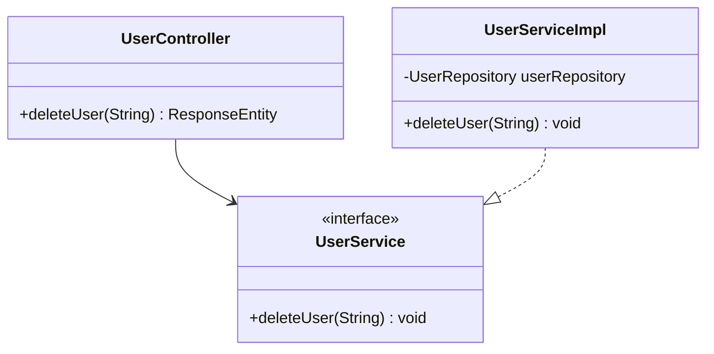

# RFC: Delete User Design

## 1. Technical Objective
Specify classes, models, and workflows to implement the user removal endpoint (`DELETE /api/v1/users/{id}`).

---

## 2. API Contract & Schema

### Endpoint Definition
```http
DELETE /api/v1/users/{id}
Authorization: Bearer <Token>
```

### Response Payload (JSON)
```json
{
  "success": true,
  "message": "User deleted successfully"
}
```

---

## 3. Structural Design



### Process Logic Workflow
1. **Security Verification**: Validate that user has the `ADMIN` role.
2. **Retrieve User**:
   - `userRepository.findById(id)` -> If empty, throw `ResourceNotFoundException("User not found with id: " + id)`.
3. **Execution**:
   - Delete document via `userRepository.deleteById(id)` (hard delete) or deactivate by saving `enabled = false`.
   - Return status JSON.
