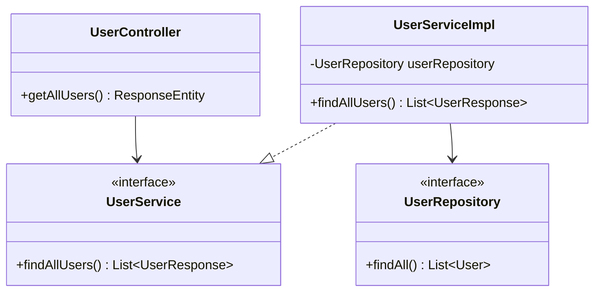

# RFC: Retrieve User List Design

## 1. Technical Objective
Specify classes and security configurations to implement the admin user directory lookup endpoint (`GET /api/v1/users`).

---

## 2. API Contract & Schema

### Endpoint Definition
```http
GET /api/v1/users
Authorization: Bearer <Token>
```

### Response Payload (JSON)
```json
{
  "success": true,
  "message": "Users retrieved successfully",
  "data": [
    {
      "id": "60c72b2f9b1d8b2bad000001",
      "username": "admin",
      "fullName": "System Administrator",
      "email": "admin@studentmgmt.com",
      "role": "ADMIN",
      "enabled": true
    }
  ]
}
```

---

## 3. Structural Design



### Flow & Authorization
1. **Security Interception**:
   - The Spring Security configuration enforces:
     ```java
     .requestMatchers("/api/v1/users/**").hasRole("ADMIN")
     ```
   - If the incoming JWT context does not hold the `ADMIN` role, the server throws an `AccessDeniedException` (translates to HTTP 403).
2. **Database Lookup**:
   - `userRepository.findAll()` reads all documents from the `users` collection.
3. **Data Mapping**:
   - Convert `User` entity records to `UserResponse` DTOs, stripping out any password field values before serialization.
