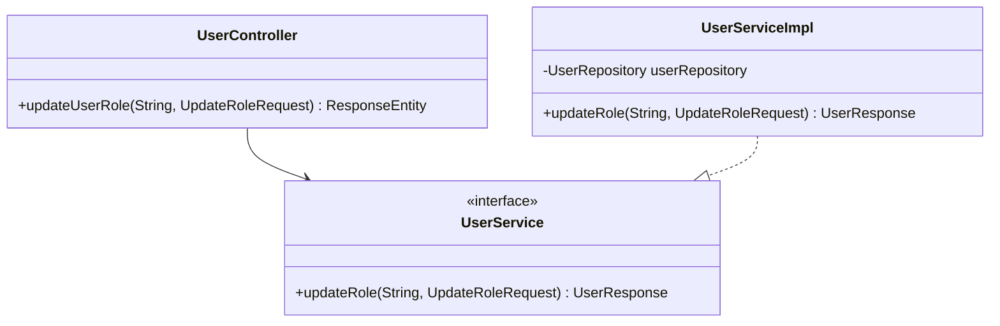

# RFC: Update User Role Design

## 1. Technical Objective
Specify classes, models, and validations to implement the user role elevation/modification endpoint (`PUT /api/v1/users/{id}/role`).

---

## 2. API Contract & Schema

### Endpoint Definition
```http
PUT /api/v1/users/{id}/role
Authorization: Bearer <Token>
Content-Type: application/json
```

### Request Payload (DTO: `UpdateRoleRequest`)
```json
{
  "role": "ADMIN"
}
```

### Response Payload (JSON)
```json
{
  "success": true,
  "message": "User role updated successfully",
  "data": {
    "id": "60c72b2f9b1d8b2bad000002",
    "username": "user",
    "fullName": "Regular User",
    "email": "user@studentmgmt.com",
    "role": "ADMIN",
    "enabled": true
  }
}
```

---

## 3. Structural Design



### Process Logic Workflow
1. **Security Interception**: Enforce `.hasRole("ADMIN")` at Security config layer.
2. **DTO Constraint Setup**:
   - `role`: `@NotBlank`, `@Pattern(regexp = "^(ADMIN|USER)$", message = "Role must be ADMIN or USER")`
3. **Database Check**:
   - `userRepository.findById(id)` -> If empty, throw `ResourceNotFoundException("User not found with id: " + id)`.
4. **Execution**:
   - Modify the User's `role` attribute.
   - Save via `userRepository.save(user)`.
   - Map and return updated object.
