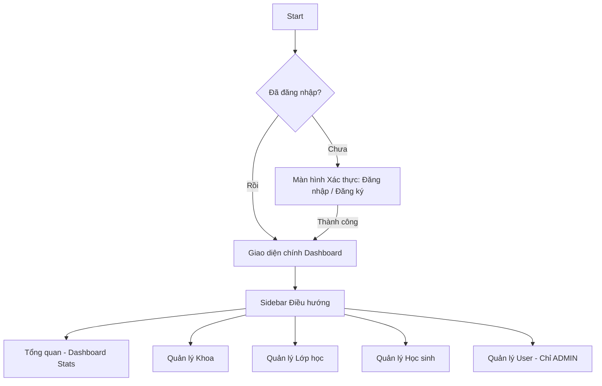

# UI/UX Specification: Student Management Dashboard

Tài liệu này đặc tả thiết kế giao diện người dùng (UI/UX) cho hệ thống Quản lý Học sinh dưới dạng ứng dụng đơn trang (**Single Page Application - SPA**), giúp người dùng tương tác trực tiếp với các API một cách trực quan, mượt mà và bảo mật.

---

## 1. Phong cách Thiết kế (Aesthetic Theme)

Ứng dụng sử dụng phong cách thiết kế **Glassmorphism** trên nền tối hiện đại (**Sleek Dark Mode**):

* **Bảng màu chủ đạo**:
  * **Primary (Chủ đạo)**: Indigo (`#6366f1` đến `#4f46e5`) - tạo cảm giác công nghệ, đáng tin cậy.
  * **Secondary (Phụ trợ)**: Emerald (`#10b981`) cho trạng thái thành công/hoàn thành, Violet (`#8b5cf6`) làm điểm nhấn.
  * **Background**: Màu xám tối sâu (`#0f172a` - Slate 900) kết hợp với các card bán trong suốt nền mờ (`backdrop-blur`).
  * **Card & Panel**: Màu xám Slate 800 (`#1e293b`) với độ mờ `bg-opacity-60` và viền mảnh (`border border-slate-700/50`).
* **Typography**: Font chữ sans-serif hiện đại (**Inter** hoặc **Outfit**), tối ưu cho việc hiển thị bảng số liệu và dashboard.
* **Micro-animations**: Hiệu ứng chuyển động mượt mà (`transition-all duration-300`) khi rê chuột (hover) vào sidebar, các nút nhấn, hoặc khi chuyển đổi tab.

---

## 2. Kiến trúc Ứng dụng & Sơ đồ Luồng (User Flow)

Ứng dụng được tổ chức dưới dạng **SPA** (Single Page Application) - toàn bộ nội dung được tải trong một trang duy nhất và cập nhật nội dung động bằng JavaScript (DOM manipulation) dựa trên trạng thái đăng nhập.

---

## 3. Mô tả Các Trang Chức năng (Screens & Components)

### 3.1 Màn hình Xác thực (Auth Screen)
* **Thiết kế**: Card trung tâm lớn có hiệu ứng mờ kính (Glassmorphism), căn giữa màn hình.
* **Thành phần**:
  * Hai tab chuyển đổi qua lại: **Đăng nhập** và **Đăng ký** với hiệu ứng trượt.
  * Form đăng ký hỗ trợ kiểm tra tính hợp lệ dữ liệu cơ bản ở client.
  * Hiển thị thông báo lỗi màu đỏ rực rỡ khi API trả về lỗi (như trùng tài khoản, sai mật khẩu).

### 3.2 Bố cục chính (Dashboard Layout)
Sau khi đăng nhập thành công, màn hình sẽ chia làm hai phần chính:
* **Thanh điều hướng bên (Sidebar)**:
  * Logo và Tên hệ thống ứng dụng.
  * Danh sách các Menu ứng dụng kèm Icon trực quan.
  * Thẻ hiển thị thông tin người dùng đang đăng nhập: **Tên**, **Role** (ADMIN/USER) được gắn Badge nổi bật.
  * Nút **Đăng xuất (Logout)** ở góc dưới cùng.
* **Khu vực nội dung chính (Main Content Area)**:
  * Nơi hiển thị động các trang chức năng khi nhấn chọn ở Sidebar.
  * Header trên cùng chứa tên trang hiện tại và hiển thị trạng thái kết nối tới Database (MongoDB).

---

### 3.3 Chi tiết các Trang chức năng chính

#### A. Trang Tổng quan (Dashboard Overview)
* **Số liệu thống kê (Stats Cards)**: 4 thẻ số liệu với màu nền gradient rực rỡ:
  1. *Tổng số Học sinh* (Gradient xanh ngọc - Emerald)
  2. *Tổng số Khoa* (Gradient tím - Violet)
  3. *Tổng số Lớp học* (Gradient xanh lam - Indigo)
  4. *Tài khoản Hệ thống* (Gradient hồng - Rose)
* **Hành động nhanh**: Phím tắt mở nhanh modal thêm học sinh hoặc chuyển hướng nhanh sang các màn hình quản lý.

#### B. Trang Quản lý Khoa (Departments)
* **Bảng danh sách Khoa**: Hiển thị ID, Tên Khoa, Ngày tạo.
* **Phân quyền hành động**:
  * Nút "Thêm Khoa mới" và các nút "Sửa/Xóa" tại mỗi dòng chỉ hiển thị/kích hoạt đối với tài khoản có quyền **`ADMIN`**.
  * Đối với quyền **`USER`**, các nút này sẽ ẩn đi hoặc bị khóa kèm tooltip thông báo.

#### C. Trang Quản lý Lớp học (Classrooms)
* **Bảng danh sách Lớp**: Hiển thị ID, Tên Lớp, và Tên Khoa chủ quản (liên kết).
* **Form/Modal**: Form thêm/sửa lớp học có menu chọn (Select) lấy danh sách Khoa hiện có từ API.

#### D. Trang Quản lý Học sinh (Students)
Đây là trang có nhiều chức năng phức tạp nhất:
* **Bộ lọc và Tìm kiếm**:
  * Ô tìm kiếm hỗ trợ tìm nhanh theo Tên, Mã SV hoặc Email (Live search).
  * Bộ lọc dạng Dropdown: Lọc theo Khoa, Lớp, Giới tính, Trạng thái.
* **Bảng dữ liệu Học sinh**:
  * Hỗ trợ nhấp vào tiêu đề cột để Sắp xếp (`sort` và `direction`).
  * Có cột hiển thị Badge màu theo trạng thái (Active: Xanh lá, Inactive: Đỏ, Graduated: Xanh dương).
* **Phân trang (Pagination)**: Các nút *Trang trước*, *Trang sau*, thông tin chỉ số trang hiện tại.
* **Modal Xem Chi tiết**: Bấm vào dòng để xem toàn bộ thông tin học sinh dạng Profile Card lớn.
* **Modal Thêm/Sửa**: Form nhập liệu với kiểm tra hợp lệ client trước khi gửi lên API (VD: số điện thoại 10 số, email đúng định dạng).

#### E. Trang Quản lý User (Chỉ ADMIN)
* Trang này chỉ hiển thị ở Sidebar và cho phép truy cập đối với ADMIN.
* Hiển thị danh sách toàn bộ các tài khoản trong hệ thống.
* Có nút thăng quyền nhanh từ `USER` lên `ADMIN` và xóa tài khoản.

---

## 4. Xử lý Trạng thái ở Client (State Management)

* **Token Storage**: Lưu trữ `accessToken`, `username`, và `role` vào `localStorage` của trình duyệt.
* **Request Interceptor**: Tự động chèn header `Authorization: Bearer <token>` vào tất cả các yêu cầu gọi tới API cần bảo mật.
* **Session Expiration**: Tự động phát hiện khi Token hết hạn (nhận mã lỗi HTTP `401` từ API), xóa thông tin đăng nhập trong `localStorage` và chuyển người dùng về màn hình đăng nhập kèm thông báo Toast cảnh báo.
* **Toast Notification**: Hiển thị thông báo nổi ở góc phải màn hình khi hoàn thành các tác vụ (Ví dụ: *"Đã xóa học sinh thành công"* - xanh lá, *"Không thể xóa lớp học do có học sinh"* - đỏ).
